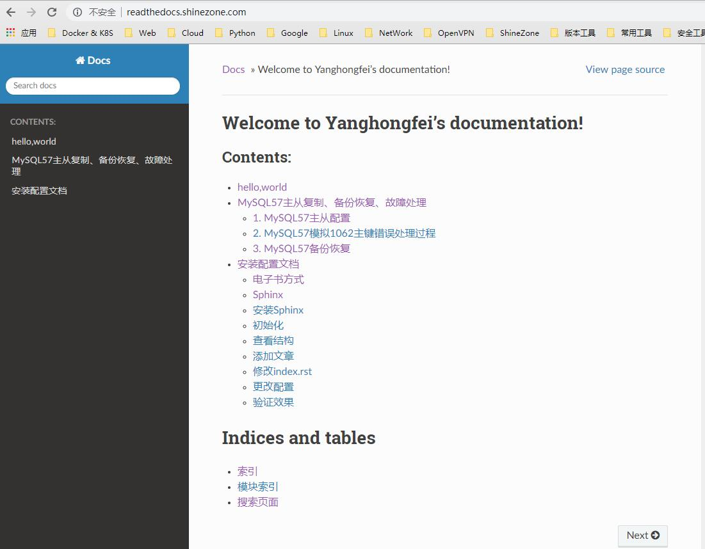
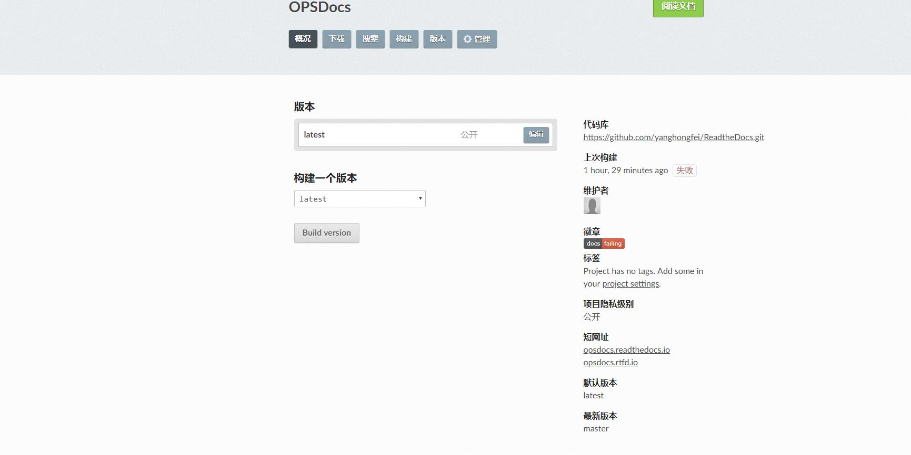

<a href="https://asciinema.org/a/H6cvHggetDYr9EHC8VqZtzIsG" target="_blank"></a>
[](https://asciinema.org/a/H6cvHggetDYr9EHC8VqZtzIsG)
Table of Contents
=================

   * [Read The Docs](#read-the-docs)
      * [电子书写作方式](#电子书写作方式)
      * [01. Nginx   Sphinx内部使用](#01-nginx--sphinx内部使用)
         * [1.1 Sphinx说明](#11-sphinx说明)
         * [1.2 安装Sphinx](#12-安装sphinx)
         * [1.3 初始化](#13-初始化)
         * [1.4 添加文章](#14-添加文章)
         * [1.5 修改index](#15-修改index)
         * [1.6 修改配置](#16-修改配置)
         * [1.7 配置nginx](#17-配置nginx)
         * [1.8 MakeHTML](#18-makehtml)
      * [02. Sphinx   GitHub   ReadtheDocs公网使用](#02-sphinx--github--readthedocs公网使用)
         * [2.1 Sphinx说明](#21-sphinx说明)
         * [2.2 安装Sphinx](#22-安装sphinx)
         * [1.3 初始化](#13-初始化-1)
         * [1.4 添加文章](#14-添加文章-1)
         * [1.5 修改index](#15-修改index-1)
         * [1.6 修改配置](#16-修改配置-1)
         * [1.7 Make HTML](#17-make-html)
         * [1.8 配合github readthedoc](#18-配合githubreadthedoc)


# Read The Docs
- Demo地址：https://yanghongfei.readthedocs.io

> Read the Docs是一个在线文档托管服务， 你可以从各种版本控制系统中导入文档，如果你使用webhooks， 那么每次提交代码后可以自动构建并上传至readthedocs网站，非常方便。


## 电子书写作方式
> Sphinx + GitHub + ReadtheDocs 作为文档写作工具，用 Sphinx 生成文档，GitHub 托管文档，再导入到 ReadtheDocs

- 写博客，跟散文堆在一起，不便索引。
- GitHub Wiki，适合做知识整理，但排版一般，不方便查看。
- GitBook，样式不好看，访问速度慢

## 01. Nginx + Sphinx内部使用
### 1.1 Sphinx说明
> Sphinx是一个基于Python的文档生成项目，最早只是用来生成 Python 官方文档，随着工具的完善， 越来越多的知名的项目也用他来生成文档，甚至完全可以用他来写书采用了reStructuredText作为文档写作语言, 不过也可以通过模块支持其他格式，待会我会介绍怎样支持MarkDown格式

### 1.2 安装Sphinx
```
$ pip install sphinx sphinx-autobuild sphinx_rtd_theme
```

### 1.3 初始化
```
$ mkdir -p /opt/ReadtheDocs
$ cd /opt/ReadtheDocs
# 执行sphinx-quickstart
> Project language [en]: zh_CN #这里选择cn区域的都默认enter
#查看结构
$ yum install tree -y
$ tree -C .
.
├── bu
├── make.bat
├── Makef
└── source
    ├── conf.py
    ├── index.rst
    ├── _static
    └── _templates

```
### 1.4 添加文章
```
   #文章可以使用markdown/rst格式
   vim source/hello.rst
   hello, world
```
### 1.5 修改index
```

  $ vim source/index.rst
    Welcome to docs's documentation!
    ================================

    .. toctree::
                  :maxdepth: 2
       :caption: Contents:

       hello    #文件名字


    Indices and tables
    ==================

    * :ref:`genindex`
    * :ref:`modindex`
    * :ref:`search`
```


### 1.6 修改配置

```
$ vim source/config.py
#更改主题为sphinx_rtd_theme
import sphinx_rtd_theme
html_theme = "sphinx_rtd_theme"
html_theme_path = [sphinx_rtd_theme.get_html_theme_path()]
#支持markdown
$ pip install recommonmark
$ vim source/config.py
from recommonmark.parser import CommonMarkParser
source_parsers = {
    '.md': CommonMarkParser,
}
source_suffix = ['.rst', '.md']
```


### 1.7 配置nginx
```
$ yum install nginx -y
server {
        listen       80;
        server_name readthedocs.domain.com;
        root   /opt/ReadtheDocs/build/html;
        index  index.php index.html index.htm;
        access_log off;
        error_log  /var/log/nginx/error_default.log warn;
    }
```

### 1.8 MakeHTML

```
$ cd /opt/ReadtheDocs/
$ make html  #会在bulid下生成html文件
```


- 查看效果图




## 02. Sphinx + GitHub + ReadtheDocs公网使用

> 也可以配合github使用，一般的做法是将文档托管到版本控制系统比如github上面，push源码后自动构建发布到readthedoc上面， 这样既有版本控制好处，又能自动发布到readthedoc

### 2.1 Sphinx说明
> Sphinx是一个基于Python的文档生成项目，最早只是用来生成 Python 官方文档，随着工具的完善， 越来越多的知名的项目也用他来生成文档，甚至完全可以用他来写书采用了reStructuredText作为文档写作语言, 不过也可以通过模块支持其他格式，待会我会介绍怎样支持MarkDown格式

### 2.2 安装Sphinx
```
$ pip install sphinx sphinx-autobuild sphinx_rtd_theme
```

### 1.3 初始化
```
$ mkdir -p /opt/ReadtheDocs
$ cd /opt/ReadtheDocs
# 执行sphinx-quickstart
> Project language [en]: zh_CN #这里选择cn区域的都默认enter
#查看结构
$ yum install tree -y
$ tree -C .
.
├── bu
├── make.bat
├── Makef
└── source
    ├── conf.py
    ├── index.rst
    ├── _static
    └── _templates

```
### 1.4 添加文章
```
   #文章可以使用markdown/rst格式
   vim source/hello.rst
   hello, world
```
### 1.5 修改index
```

  $ vim source/index.rst
    Welcome to docs's documentation!
    ================================

    .. toctree::
                  :maxdepth: 2
       :caption: Contents:

       hello    #文件名字


    Indices and tables
    ==================

    * :ref:`genindex`
    * :ref:`modindex`
    * :ref:`search`
```


### 1.6 修改配置

```
$ vim source/config.py
#更改主题为sphinx_rtd_theme
import sphinx_rtd_theme
html_theme = "sphinx_rtd_theme"
html_theme_path = [sphinx_rtd_theme.get_html_theme_path()]
#支持markdown
$ pip install recommonmark
$ vim source/config.py
from recommonmark.parser import CommonMarkParser
source_parsers = {
    '.md': CommonMarkParser,
}
source_suffix = ['.rst', '.md']
```

### 1.7 Make HTML

```
make html #生成html文件
```


### 1.8 配合github+readthedoc

- Github 新建一个项目
- 将代码上传到Github
- 注册一个readthedoc账户，网址：https://readthedocs.org/
- Import a project 选择从github导入
- 进入项目选择语言，改为`chinesis`
- 根据提供网址访问，后续维护只需要`make html`后 `push`到github即可，会自动编译

效果图：




